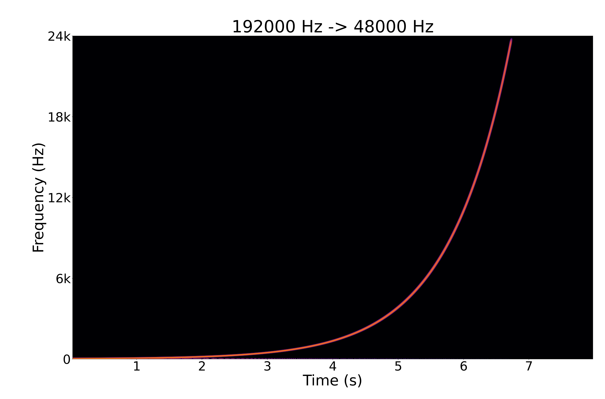

# `resampler`

A small command-line WAV resampler built on [r8brain-free-src](https://github.com/avaneev/r8brain-free-src), the sample rate converter designed by Aleksey Vaneev of Voxengo.

### Build

```sh
make
```

The binary is created at `dist/resampler`.

### Usage

```sh
./dist/resampler -i ~/wav/input-dir -o ~/wav/output-dir -r 48000 -b 24
```

`sample_rate` may be any positive target rate supported by r8brain. Common values include `44100`, `48000`, `88200`, `96000`, `176400`, and `192000`.

`bit_depth` may be `16`, `24`, `32`, or `float`.

Example:

```sh
dist/resampler -i input-wavs -o output-wavs -r 48000 -b 24
```

### Clean

```sh
make clean
```

Removes `build/` and `dist/`.

### Quality



See [`doc/testing.md`](./doc/testing.md) for the process and more spectrograms.

### Disclaimers

* The slop in [`resampler/`](./resampler) was generated using various models in the OpenCode harness. 
* This is a one-off utility and is unlikely to be maintained; likely unfit for production systems.
