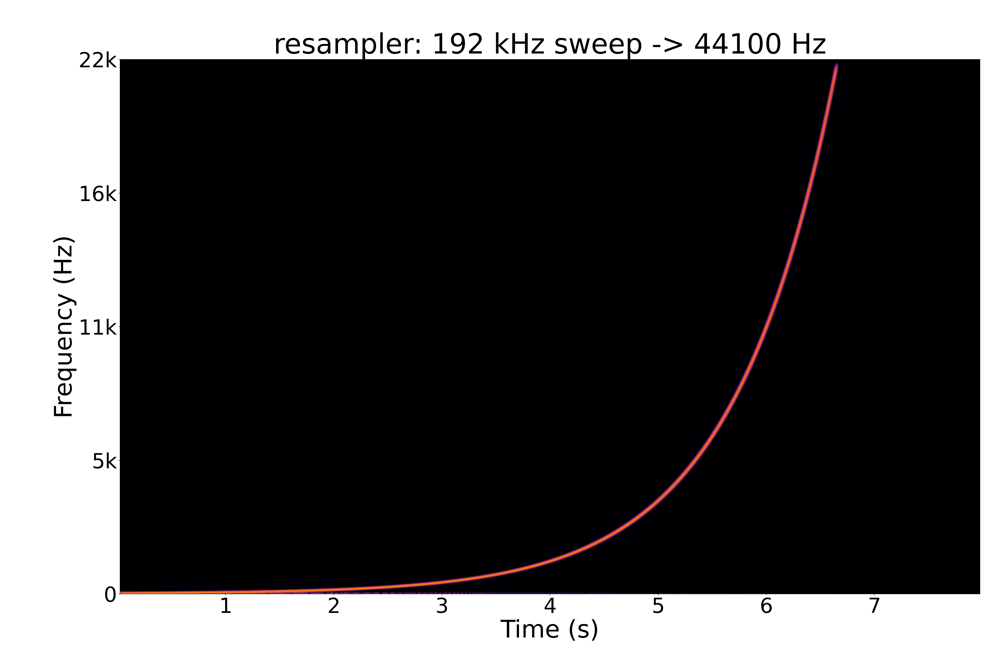
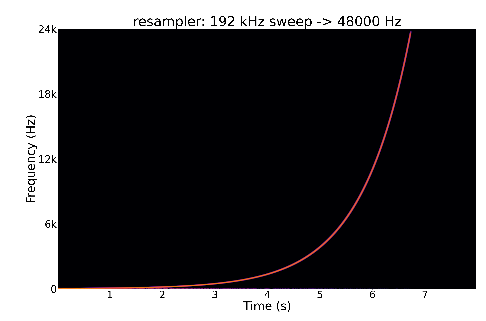
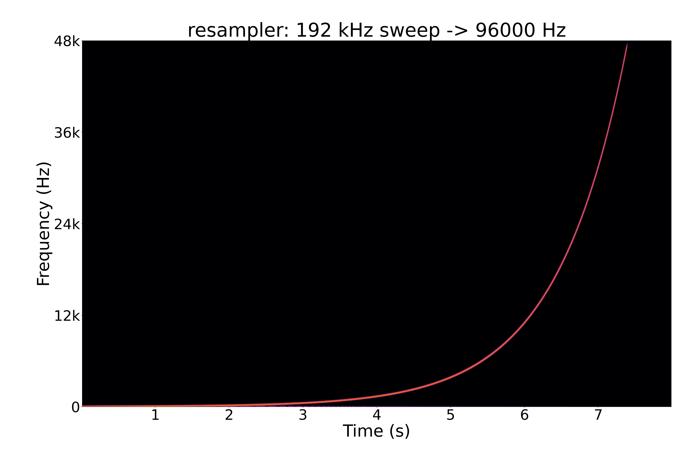

# Testing

The quality demo generates a 192 kHz logarithmic sine sweep, resamples it, and renders spectrograms with SoX. The main thing to look for is aliasing: mirrored sweep lines or broad junk above the target Nyquist frequency.

Requirements:

- Python with `numpy`, `scipy`, and `matplotlib`

Run it from the repo root:

```sh
./tooling/run-quality-demo.sh
```

Generated WAV files go under `tmp/quality/`. PNGs are written to `doc/img/`.

The script also runs `tooling/analyze-quality.py`, which measures:

- RMS drop after the sweep crosses the target Nyquist frequency
- strongest off-track spectral peak while the sweep is in band
- strongest post-cutoff spectral peak

This catches broken source sweeps and obvious aliasing regressions without relying on the PNGs alone.

## Outputs

### 44.1 kHz



### 48 kHz



### 96 kHz


