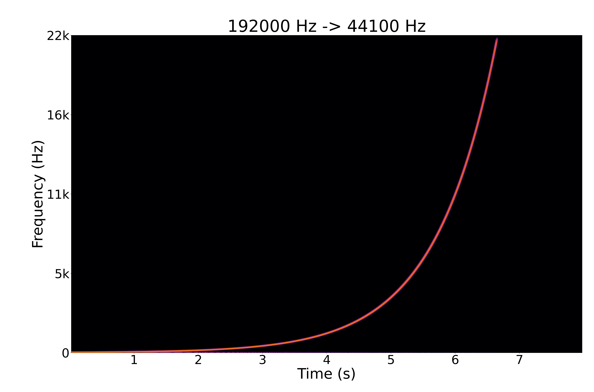
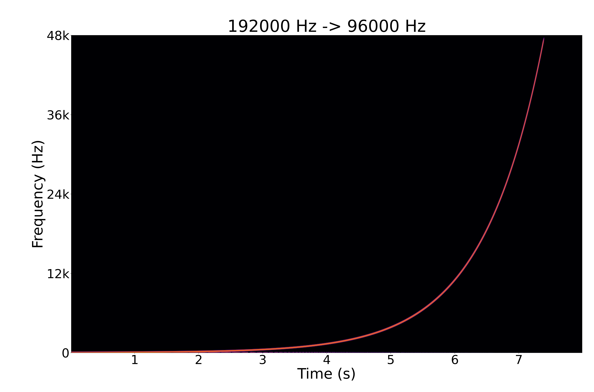
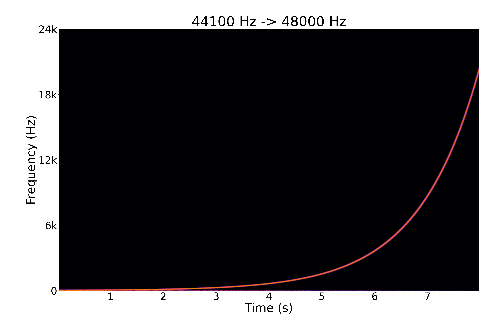
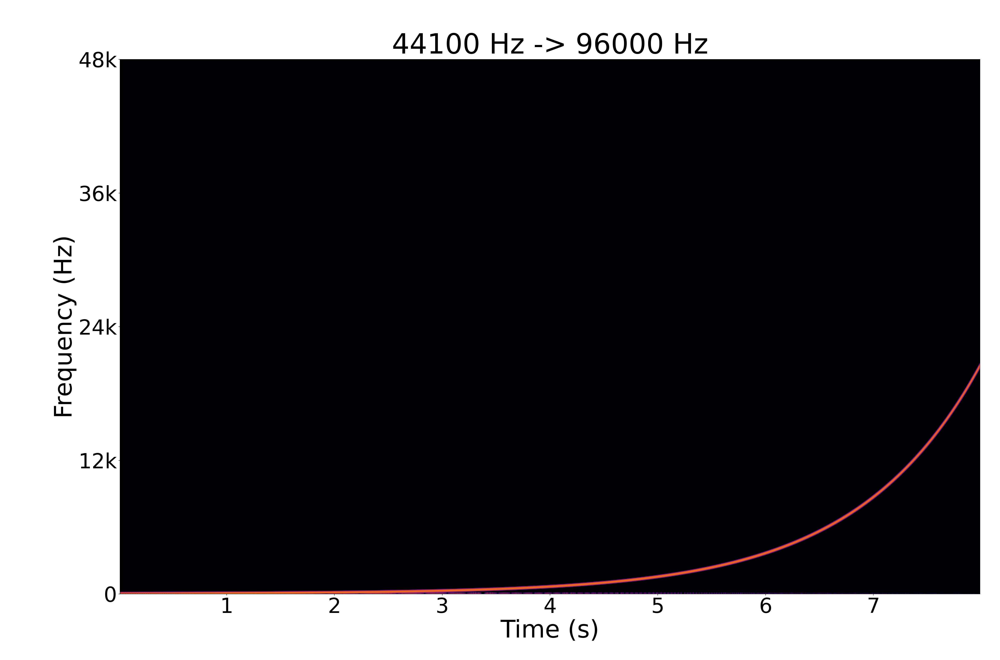
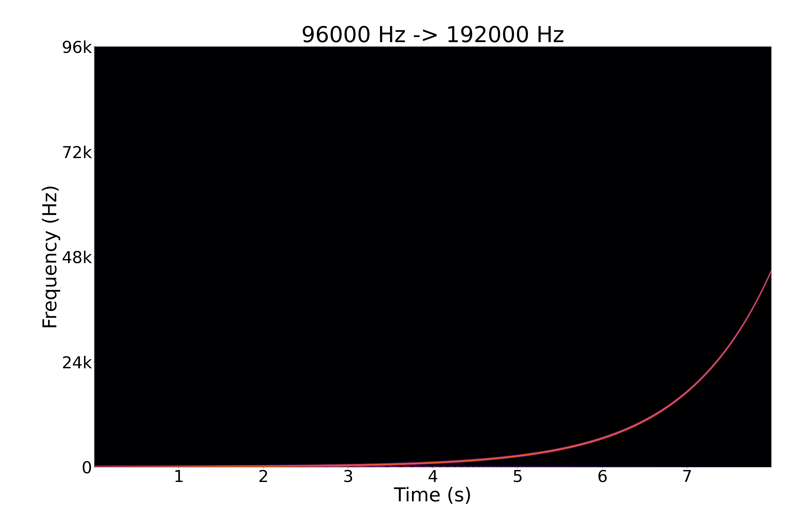

# Testing

The quality demo generates logarithmic sine sweeps at 192 kHz, 96 kHz, and 44.1 kHz, resamples them to various output rates, and renders spectrograms. The main thing to look for is aliasing: mirrored sweep lines or broad junk above the target Nyquist frequency.

Requirements:

- Python with `numpy`, `scipy`, and `matplotlib`

Run it from the repo root:

```sh
./tooling/run-quality-demo.sh
```

Generated WAV files go under `tmp/quality/`. Spectrograms are written to `doc/img/` as lossless WebP.

The script also runs `tooling/analyze-quality.py`, which measures:

- RMS drop after the sweep crosses the target Nyquist frequency
- strongest off-track spectral peak while the sweep is in band
- strongest post-cutoff spectral peak

This catches broken source sweeps and obvious aliasing regressions without relying on the PNGs alone.

## Downsampling

### 192 kHz -> 44.1 kHz



### 192 kHz -> 48 kHz


### 192 kHz -> 96 kHz



## Upsampling

### 44.1 kHz -> 48 kHz



### 44.1 kHz -> 96 kHz



### 96 kHz -> 192 kHz


